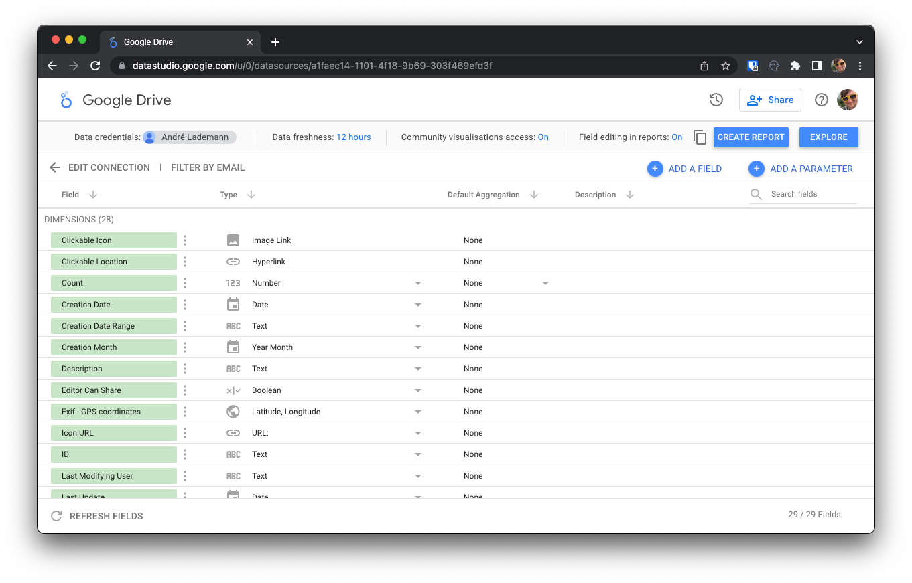
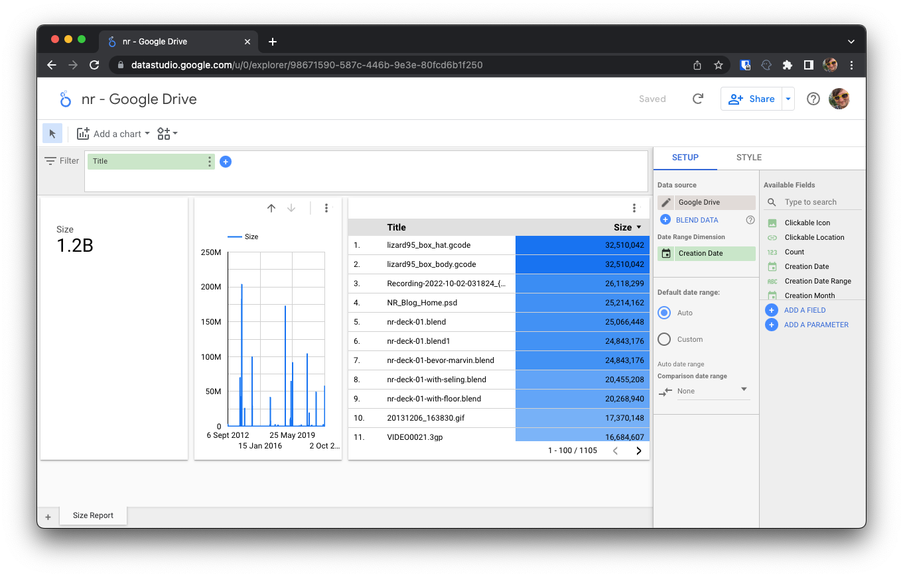
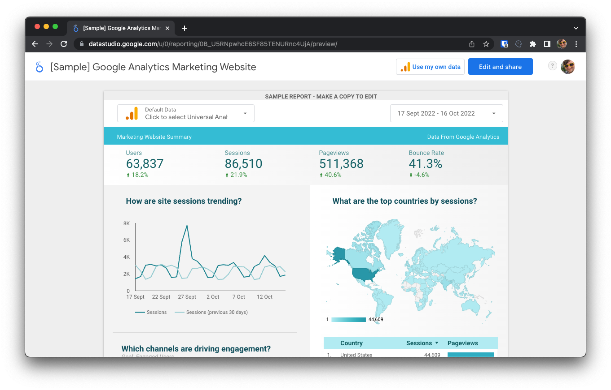
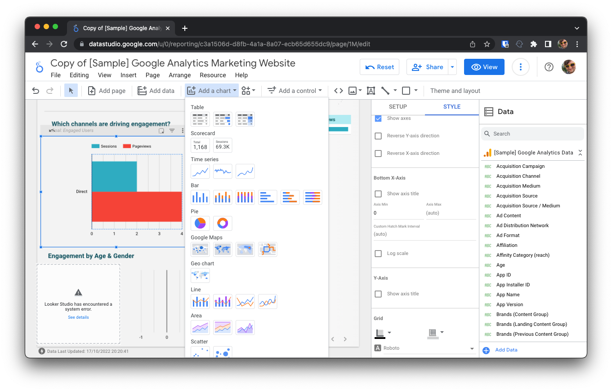

# 💬 Talk: BI mit Googles Looker

## Ziel des Talks

_BI - Business Intelligence_  ist vor allem bei größeren Unternehmen bekannt, um dort anhand von großen Datenmengen Prozesse zu optimieren und damit Kosten zu senken - respektive die Gewinne zu steigern. Microsoft Power BI ist in den letzten Jahren stark verbreitet. Google hat mit Looker eine ähnliche Lösung im Angebot. In diesem Talk möchte ich einen Einblick in die Welt der BI geben und habe auch Aspekte gefunden, wie BI helfen auch bei kleineren Unternehmen (unter 100 Angestellte) Prozesse transparenter zu machen und einen monetären Mehrwert zu generieren.

## Was ist BI?

Bei BI geht es darum, durch Visualisierung aus großen Datenmengen Möglichkeiten zur Optimierung zu identifizieren. Diese dienen vor allem heutzutage meist noch Menschlichen Entscheidungsträgern. Allerdings wird schon heute auch KI (Künstliche Intelligenz) eingesetzt. BI ist also ein Teilbereich von Data Science.
Das Besondere bei BI ist, dass automatisiert (z.B. alle 12h) Reports (z.B. PDF) erstellt werden können, bei dem verschiedene Datenquellen zusammengeführt werden.

## Was ist Looker?

Looker ist Teil der Google Cloud Plattform und bietet eine ähnliche Lösung wie Microsoft Power BI. Looker hat allerdings ein paar Vorteile:

- Es wird im Browser ausgeführt und ist damit Plattformunabhängig
- Die Dateiverwaltung geschieht ausschließlich in der Cloud, was die Zusammenarbeit erleichtert

### Welche Datenquellen gibt es?

Auch hier gibt es eine große Auswahl. Looker kann mit allen gängigen Datenquellen arbeiten. Hier eine Auswahl:

- Datenbanken (z.B. MySQL, PostgreSQL, Oracle, SQL Server)
- Google Analytics
- Google Ads
- Google Search Console
- Google Sheets
- Dateien (z.B. CSV, Excel, JSON, XML)
- Logfiles
- LinkedIn
- Twitter
- Facebook
- … und viele mehr

## Beispiel Fragestellungen

Dabei geht es in den verschiedenen Abteilungen um ganz unterschiedliche Fragestellungen.

***Marketing:*** Welchen Impact hatte eine Werbeanzeige auf Klicks *(Google Analytics)* und Leads *(z.B. Hubspot)*.

***HR:*** Aus welchen Regionen der Erde kommen die Menschen, die auf der Webseite *(Google Anayltics)* die Karriere-Seite aufgerufen haben.

***Support:*** Wie viele Supportanfragen wurden in den letzten 12 Monaten gestellt und wie viele davon wurden beantwortet. *(z.B. Zendesk,  Apple Store, Google Play Store)*

***Vertrieb:*** Wie viele Leads wurden in den letzten 12 Monaten generiert und wie viele davon wurden zu Kunden *(z.B. Hubspot)*.

**Auch für interne Prozesse kann BI genutzt werden:**

***HR*** Steht die Anzahl der offenen Tickets (Jira) im Zusammenhang mit der angegebenen Workload in der Mitarbeiter-Umfrage (Google Sheet).

## Hands-On

1. Looker Account erstellen
2. Datenquelle hinzufügen
3. Bericht erstellen
4. Exportieren
5. Explorer verwenden

## Screenshots

Falls etwas schief geht, habe ich zumindest noch Screenshots gemacht.

Datenquelle hinzufügen:

Daten mit dem Explorer Untersuchen und Visualisieren:

Bericht erstellen und exportieren:

Einen Bericht um weitere Charts erweitern:

Und hier ein Beispiel-Report, der aus Looker exportiert wurde: [report.pdf](Media/report.pdf)

## Fazit

Looker ist eine sehr leistungsfähige Lösung, die sich auch für kleinere Unternehmen eignet. Die Datenquellen sind vielfältig und die Visualisierung ist sehr ansprechend. Die Zusammenarbeit ist einfach und die Reports können automatisiert erstellt werden. Looker ist eine sehr gute Alternative zu Microsoft Power BI.

## Links

- [Looker](https://looker.com/)
- [Looker Demo](https://demo.looker.com/)
- [Looker Blog](https://looker.com/blog)
- [Looker Youtube](https://www.youtube.com/c/Looker)

## Fragen?

[https://twitter.com/vergissberlin](https://twitter.com/vergissberlin)
